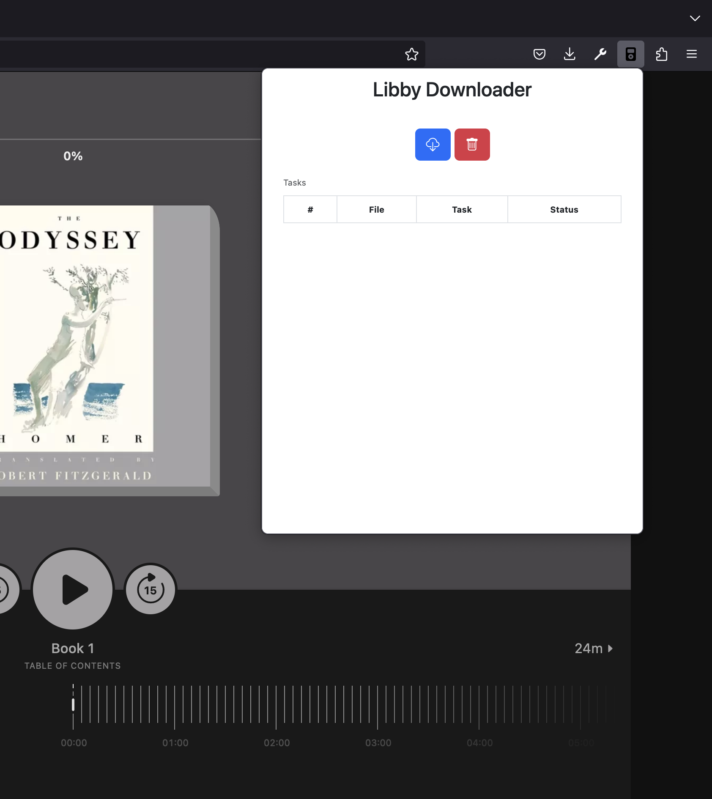
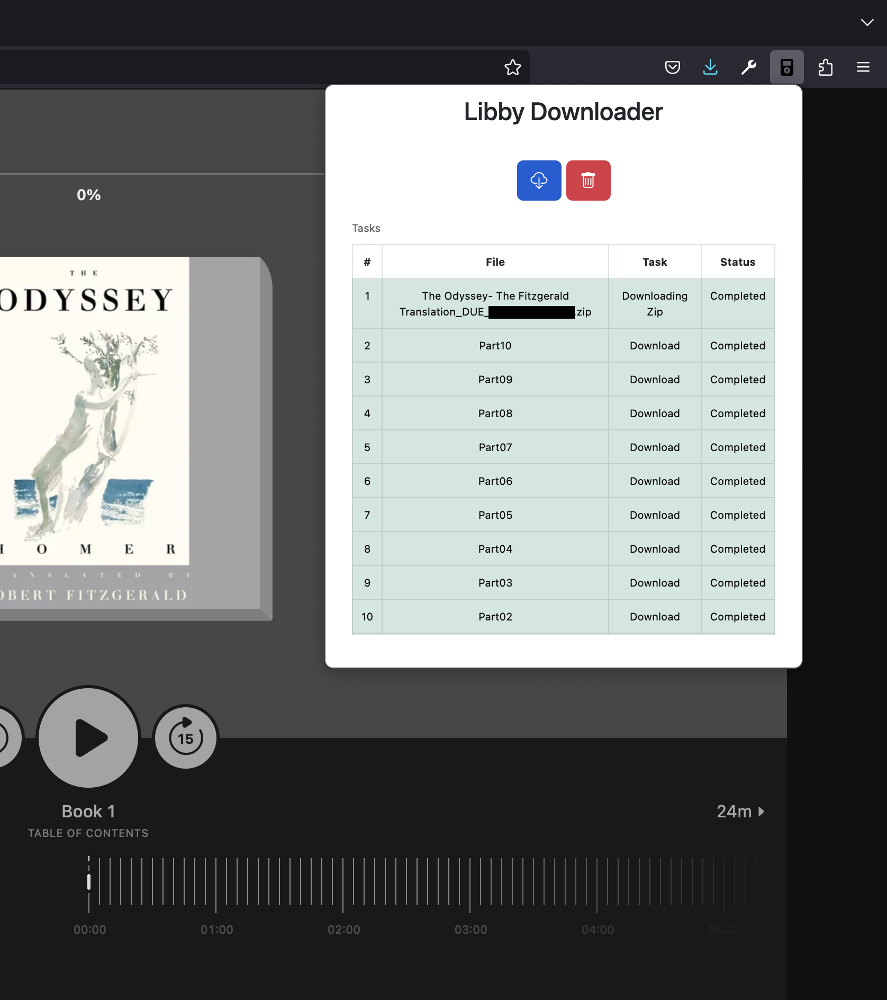
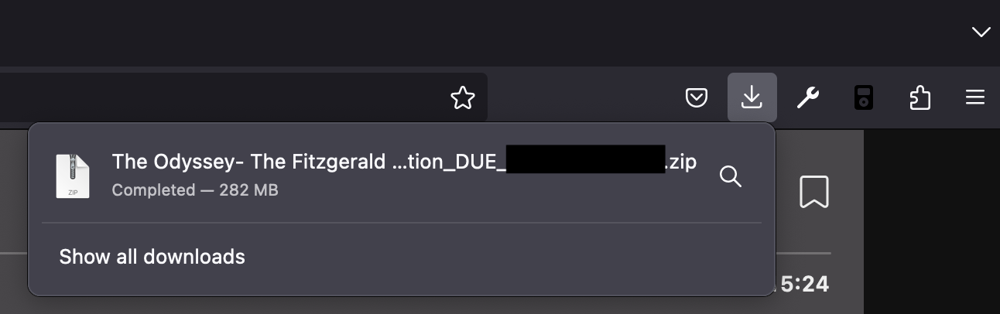

# Libby Downloader

Libby Downloader is a Firefox extension that allows for download and transfer of audiobooks from
the Libby website for transfer to devices that are now unsupported (e.g. the Sansa Clip).

## Installation
Install Libby Downloader from the [Firefox Extension Store](https://addons.mozilla.org/en-US/firefox/extensions/).

## Disclaimer
Books downloaded by this tool are still due on their due date. This tool is **not** intended to help you "keep" your
borrowed books. The due date can be found in the filename and MP3 tags.

## Use
Navigate to a borrowed audiobook on [Libby](https://libbyapp.com) and open the extension.

Click the download button to begin downloading your audiobook.

Once finished, there will be a zip file in your downloads folder containing the processed mp3.

## Technical Details 
Like Overdrive, Libby hosts Audiobooks in multiple part files, and chapters can span multiple parts. The output
zip file contains a single mp3 created by merging all the parts and a cue file with the chapter boundaries 
in relation to this merged file (instead of their individual part file as Libby stores them).

### MP3 Tags
The MP3 is created with the following ID3v2 tags
* title: Audiobook Title `<title>: <subtitle> (<series>)`
* album: Audiobook Title `<title>: <subtitle> (<series>)`
* artist: Comma separated list of authors
* composer: Comma separated list of narrators
* image: Cover from Libby
* validUntil: Due date
* chapters: Embedded chapter locations

### Chapters 
If your device doesn't support embedded chapters via ID3v2 tags you can:

#### Split by Chapter
The mp3 can be split into a file per chapter by various tools which understand the accompanying cue file
or https://github.com/yermak/AudioBookConverter. 

#### Convert to M4B
The mp3 can be converted into an m4b file by using a tool like ffmpeg or https://github.com/yermak/AudioBookConverter
which do understand embedded chapter information.